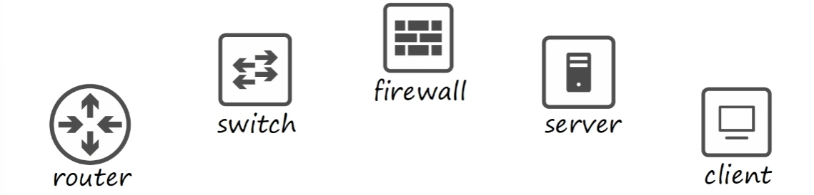
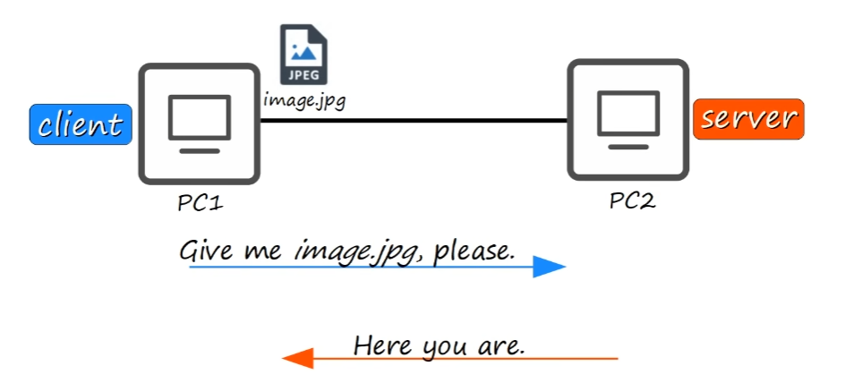
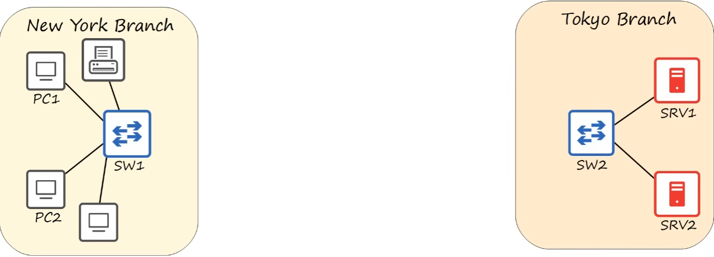
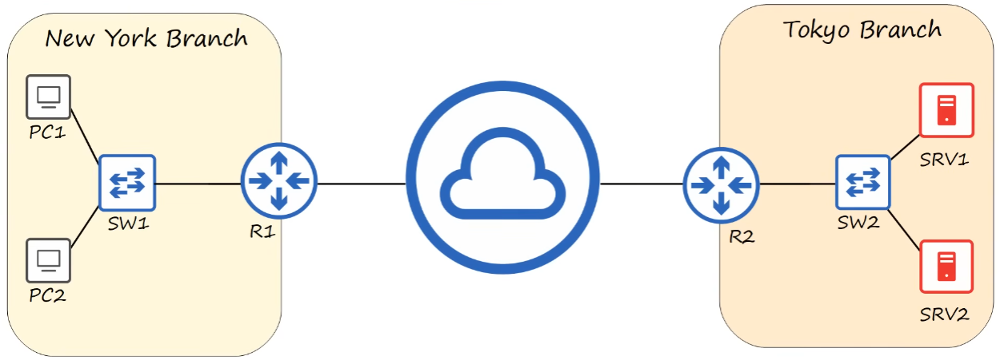
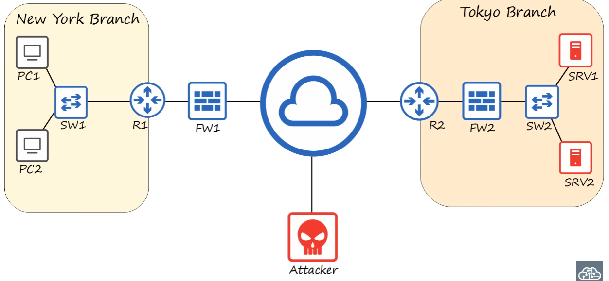

# Lab 01 - Networking Devices
- Mạng máy tính là một hệ thống kết nối các thiết bị, cho phép chúng giao tiếp và chia sẻ tài nguyên với nhau 

- Node mạng: là một thiết bị hay điểm kết nối tham gia vào mạng

---
## Client - Server

- Server: IBM Server, Dell Server - là thiết bị cung cấp các chức năng/dịch vụ cho Client.

- Client: laptop, iMac, iPhone, desktop - là thiết bị truy cập hoặc sử dụng dịch vụ do Server cung cấp.

Server và Client: được gọi là thiết bị đầu cuối (end hosts/endpoints).

> Một thiết bị có thể đóng vai trò là Client trong tình huống này nhưng lại là Server trong tình huống khác.
> Tùy vào việc nó đang yêu cầu hay cung cấp dịch vụ.
---
## Switch

- Switch: dùng để kết nối các end host trong cùng một mạng LAN (Local Area Network).

- Switch có nhiều giao diện mạng/cổng (interfaces/ports) để các end host như PC, Server hoặc máy in kết nối vào, thường có 24 cổng hoặc nhiều hơn.

- Switch dùng để chuyển tiếp lưu lượng trong cùng một mạng LAN.

- Switch cung cấp khả năng kết nối giữa các thiết bị trong cùng một mạng LAN.

- Switch thông thường không cung cấp kết nối giữa các LAN khác nhau hoặc trực tiếp định tuyến lưu lượng qua Internet.

> Thiết bị Switch: Catalyst 9200, Catalyst 3650
---
## Router

- Router: là bộ định tuyến, thường có ít interface hơn Switch.

- Router được dùng để kết nối các mạng khác nhau với nhau.

- Trong khi Switch chuyển tiếp dữ liệu trong cùng một LAN, Router chuyển tiếp dữ liệu giữa các LAN/mạng khác nhau.

- Router cũng được sử dụng để gửi dữ liệu từ mạng LAN ra các mạng bên ngoài, bao gồm Internet.

> Thiết bị Router: ISR 1009, ISR 900, ISR 4000
---
## Firewall

- Firewall: là thiết bị hoặc phần mềm bảo mật dùng để giám sát và kiểm soát lưu lượng mạng dựa trên các quy tắc (security rules) được cấu hình.

- Firewall có thể cho phép (allow/permit) hoặc từ chối (deny/block) lưu lượng mạng.

- Firewall được cấu hình để từ chối những lưu lượng trái phép và bảo vệ các end host như PC, Server.

    + Tường lửa giám sát và kiểm soát lưu lượng mạng dựa trên các quy tắc được cấu hình.

    + Tường lửa có thể được đặt bên ngoài Router hoặc bên trong mạng, sau Router.
    
    + Tường lửa có thể lọc lưu lượng trước khi nó đến Router hoặc sau khi lưu lượng đã đi qua Router.
---
## Network Firewall

- Network Firewall: là thiết bị phần cứng dùng để lọc lưu lượng giữa các mạng.

> Thiết bị: ASA 5500-X, Firepower 2100
---
## Host-based Firewall

- Host-based Firewall: là phần mềm chạy trực tiếp trên một thiết bị đầu cuối như PC hoặc Server.

- Host-based Firewall dùng để lọc lưu lượng truy cập đi vào và đi ra khỏi chính thiết bị đó.

> Ví dụ: Windows Defender Firewall.
---
## Next-Generation Firewall

- Next-Generation Firewall (NGFW): là tường lửa kết hợp các chức năng firewall truyền thống với những khả năng bảo mật và lọc lưu lượng nâng cao.

> IPS (Intrusion Prevention System).
> Khả năng phân tích và kiểm soát lưu lượng nâng cao.

Các dòng ASA hiện đại cũng có thể tích hợp các tính năng bảo mật nâng cao.
