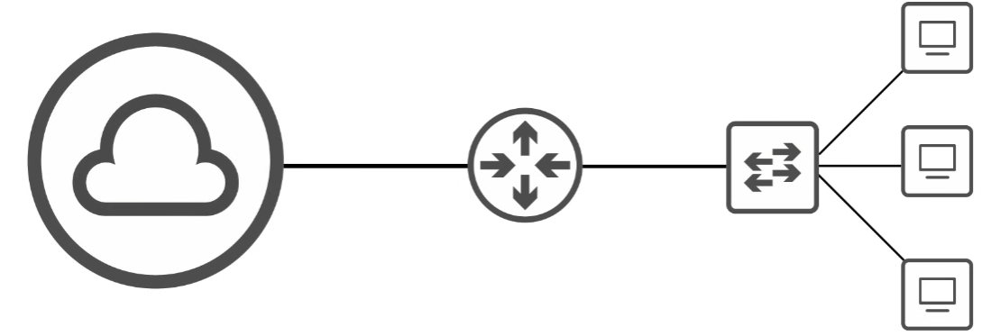
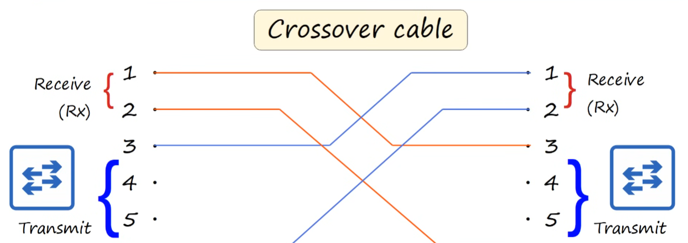

# Lab 02 - Interfaces and Cables



## 1. Interfaces - RJ45

* **Interface / Port**: cổng dùng để kết nối các thiết bị mạng với nhau.

* Switch thường có nhiều port để kết nối PC, Server,...

* **RJ-45 (Registered Jack)**: đầu kết nối thường dùng cho cáp Ethernet đồng.

* RJ-45 có **8 pins**, tương ứng với 8 dây của cáp UTP.

---

## 2. Ethernet

* **Ethernet** là tập hợp các giao thức và tiêu chuẩn mạng, không phải chỉ một protocol.

* Ethernet quy định nhiều thứ như: interfaces, cables, tốc độ truyền,...

* Các chuẩn Ethernet được định nghĩa theo **IEEE 802.3**.

> IEEE = Institute of Electrical and Electronics Engineers

### Network Protocol

* Protocol có thể hiểu là **quy tắc chung để các thiết bị giao tiếp với nhau**.
* Nếu các thiết bị không cùng tuân theo một chuẩn thì sẽ không giao tiếp được.

### Bits - Bytes

* Bit được biểu diễn bằng binary: `0` hoặc `1`.
* `8 bits = 1 Byte`
* Tốc độ mạng được tính bằng **bits per second (bps)**.

```text
1 Kb = 1,000 bits
1 Mb = 1,000,000 bits
1 Gb = 1,000,000,000 bits
1 Tb = 1,000,000,000,000 bits
```

> `b = bit`, `B = Byte`

---

## 3. Ethernet Standards

| Standard   | Speed    | Pairs | Max Length |
| ---------- | -------- | ----- | ---------- |
| 10BASE-T   | 10 Mbps  | 2     | 100m       |
| 100BASE-T  | 100 Mbps | 2     | 100m       |
| 1000BASE-T | 1 Gbps   | 4     | 100m       |
| 10GBASE-T  | 10 Gbps  | 4     | 100m       |

Trong `1000BASE-T`:

* `1000` → tốc độ
* `BASE` → Baseband
* `T` → Twisted Pair

---

## 4. UTP Cable

**UTP = Unshielded Twisted Pair**

* Là cáp đồng thường dùng trong Ethernet.
* Có **4 pairs = 8 wires**.
* Các cặp dây được xoắn với nhau để giảm **EMI - Electromagnetic Interference**.

### 10BASE-T / 100BASE-T

Chỉ sử dụng 2 pairs:

```text
Pins 1,2
Pins 3,6
```

**PC / Router / Firewall**

```text
1,2 → TX
3,6 → RX
```

**Switch**

```text
1,2 → RX
3,6 → TX
```

> PC, Router, Firewall giống nhau. Switch ngược lại.

**Full Duplex**: hai thiết bị có thể gửi và nhận dữ liệu cùng lúc.

---

## 5. Cáp thẳng - Cáp chéo



### Straight-through Cable

* Các pin hai đầu nối giống nhau.

```text
1 → 1
2 → 2
3 → 3
6 → 6
```

Thường dùng:

```text
PC     ↔ Switch
Router ↔ Switch
```

### Crossover Cable

* Đảo cặp TX và RX.

```text
1 → 3
2 → 6
3 → 1
6 → 2
```

Thường dùng:

```text
PC     ↔ PC
Router ↔ Router
Switch ↔ Switch
PC     ↔ Router
```

### Cách nhớ

> Khác loại → cáp thẳng
> Cùng loại → cáp chéo

Quy tắc này chủ yếu cần nhớ với **thiết bị cũ**.

---

## 6. Auto MDI-X

* Thiết bị mạng hiện đại thường có **Auto MDI-X**.
* Nó tự phát hiện TX/RX và điều chỉnh lại các pin.

→ Vì vậy hiện nay dùng **cáp thẳng hay cáp chéo thường vẫn hoạt động**.

---

## 7. Gigabit Ethernet

`1000BASE-T` và `10GBASE-T` sử dụng cả:

```text
4 pairs = 8 wires
```

Các pair:

```text
1-2
3-6
4-5
7-8
```

Khác với 10/100BASE-T, mỗi pair có thể truyền dữ liệu theo **cả hai hướng (bidirectional)**.

---

## 8. Fiber Optic

Ngoài UTP còn có **Fiber Optic - cáp quang**.

* UTP truyền bằng **tín hiệu điện**.
* Fiber truyền bằng **ánh sáng qua sợi thủy tinh**.
* Fiber thường kết nối vào Switch/Router thông qua **SFP transceiver**.

> SFP = Small Form-factor Pluggable

Cấu tạo cơ bản:

```text
Core → Cladding → Buffer → Outer Jacket
```

Có 2 loại chính:

### Multimode Fiber

* Core lớn hơn.
* Truyền nhiều mode ánh sáng.
* Khoảng cách ngắn hơn Single-Mode.
* Thường dùng LED.
* Rẻ hơn.

### Single-Mode Fiber

* Core nhỏ hơn.
* Truyền một mode ánh sáng.
* Khoảng cách xa hơn.
* Thường dùng Laser.
* Đắt hơn.

Một số chuẩn cần biết:

| Standard    | Fiber       | Distance   |
| ----------- | ----------- | ---------- |
| 1000BASE-LX | MM / SM     | 550m / 5km |
| 10GBASE-SR  | Multimode   | 400m       |
| 10GBASE-LR  | Single-Mode | 10km       |
| 10GBASE-ER  | Single-Mode | 30km       |

---

## 9. UTP vs Fiber

| UTP                | Fiber         |
| ------------------ | ------------- |
| Cáp đồng           | Sợi thủy tinh |
| Tín hiệu điện      | Ánh sáng      |
| RJ-45              | SFP           |
| Rẻ hơn             | Đắt hơn       |
| Tối đa khoảng 100m | Đi xa hơn     |
| Có thể bị EMI      | Không bị EMI  |

* **UTP**: thường dùng PC/Server → Switch trong LAN.
* **Fiber**: dùng khi cần khoảng cách xa hoặc tốc độ cao.
